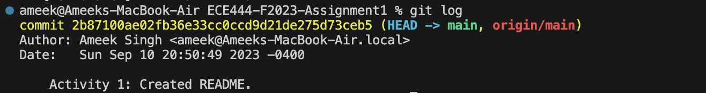
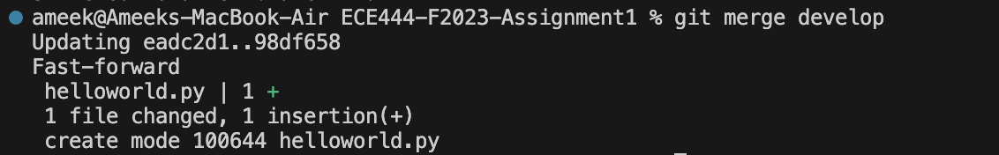
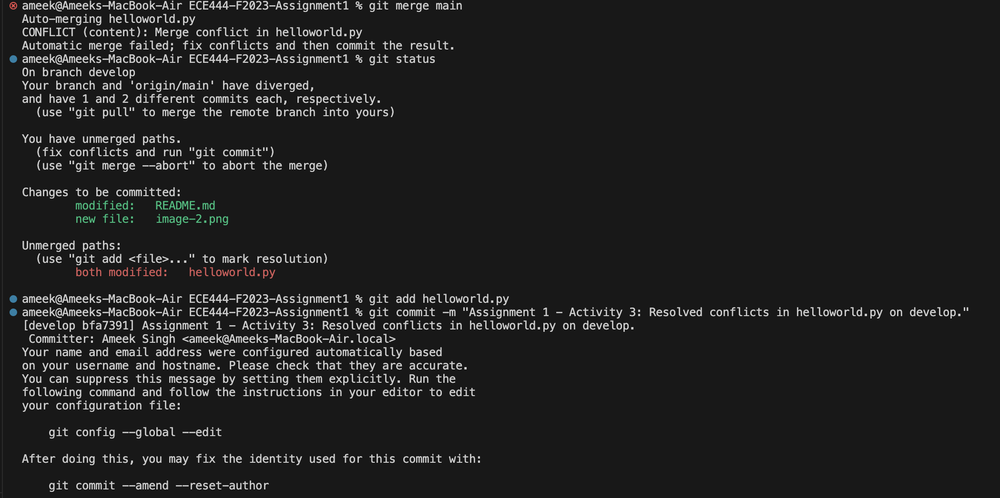
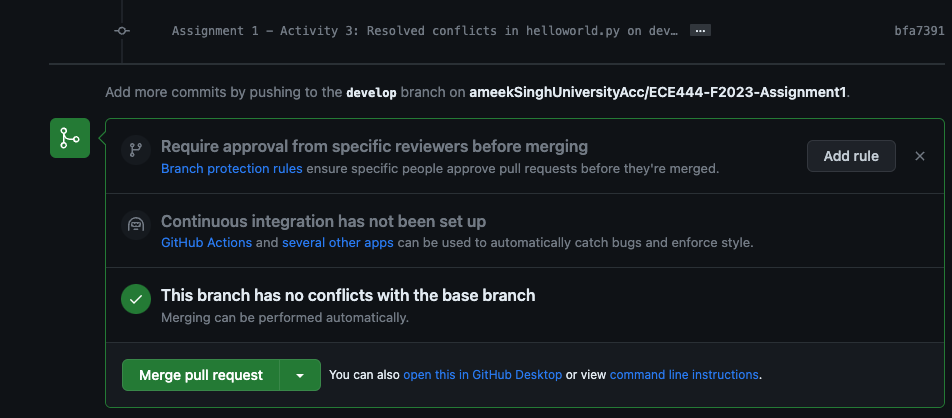
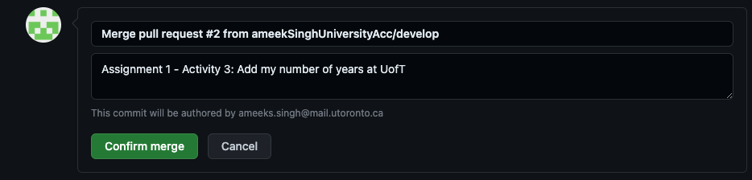
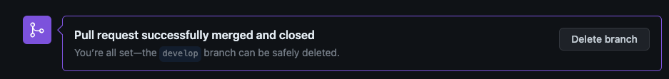
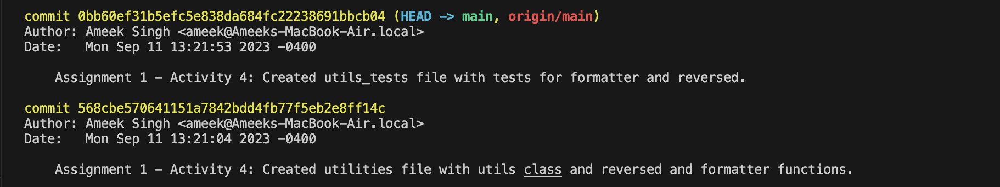
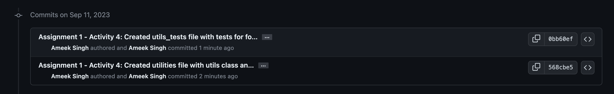
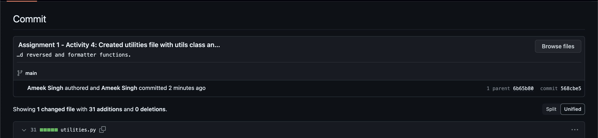
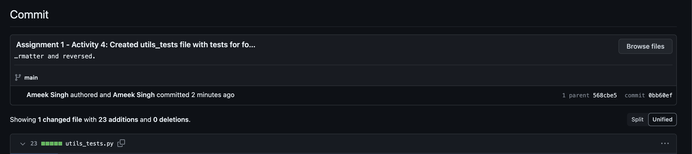

## Ameek Singh

### Activity 1
#### Screenshot of commit from Github.com

#### Screenshot of commit from local machine's terminal

### Activity 2
#### Screenshot of merge command output

### Activity 3
#### Screenshot of successful merge - from local machine terminal

#### Screenshot of successful merge commit - from Github.com

#### Screenshots showing PR eligible to merge after merge commit - from Github.com

#### Screenshot showing completed merge - from Github.com

### Activity 4
#### Screenshot of successful commits - from local machine terminal

#### Screenshot of successful commits - from Github.com

