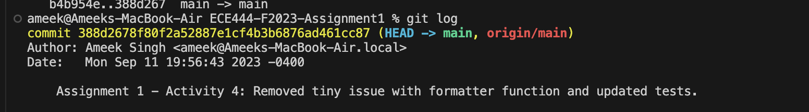
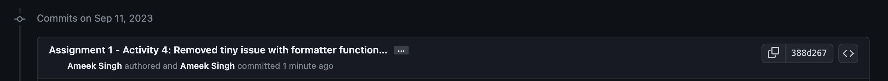
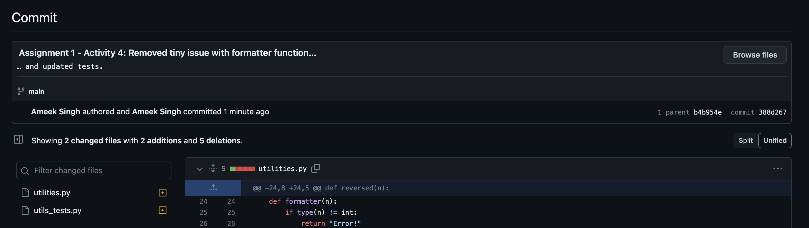
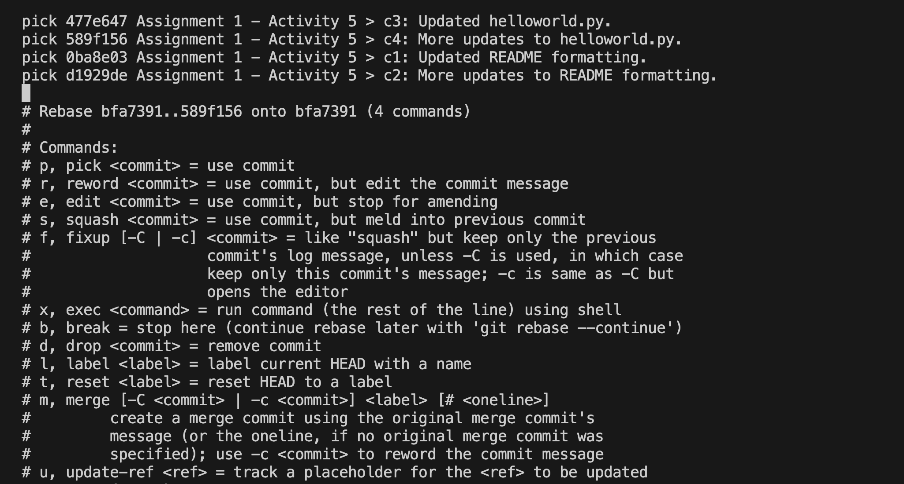
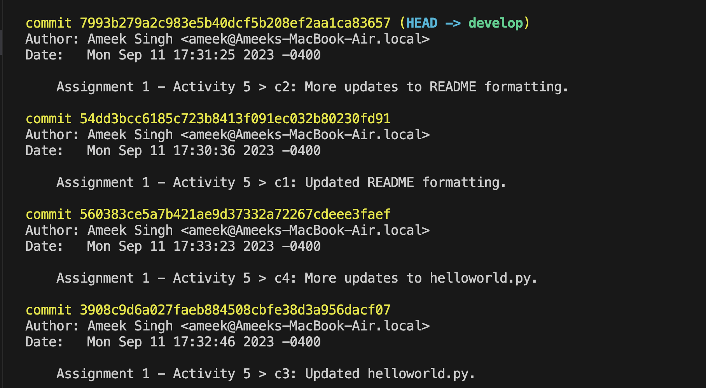

## Ameek Singh

### Activity 1
#### Screenshot of commit from Github.com

#### Screenshot of commit from local machine's terminal

### Activity 2
#### Screenshot of merge command output

### Activity 3
#### Screenshot of successful merge - from local machine terminal

#### Screenshot of successful merge commit - from Github.com

#### Screenshots showing PR eligible to merge after merge commit - from Github.com

#### Screenshot showing completed merge - from Github.com

### Activity 4
#### Screenshot of successful commits - from local machine terminal

#### Screenshot of successful commits - from Github.com

#### Screenshot of succesful commit fixing tiny bug with negative numbers not being formatted - from local machine terminal

#### Screenshot of succesful commit fixing tiny bug with negative numbers not being formatted - from Github.com

### Activity 5
#### References:
> git branch: https://git-scm.com/book/en/v2/Git-Branching-Branch-Management

> git rebase: https://git-scm.com/book/en/v2/Git-Tools-Rewriting-History, https://git-scm.com/docs/git-rebase
#### Screenshot of successful rebase with commit history - from local machine terminal

#### Screenshot of interactive rebase to reorder commits (including commands specified) - from local machine terminal

#### Screenshot of updated commit history - from local machine terminal

#### Screenshot of updated commit history - from Github.com
